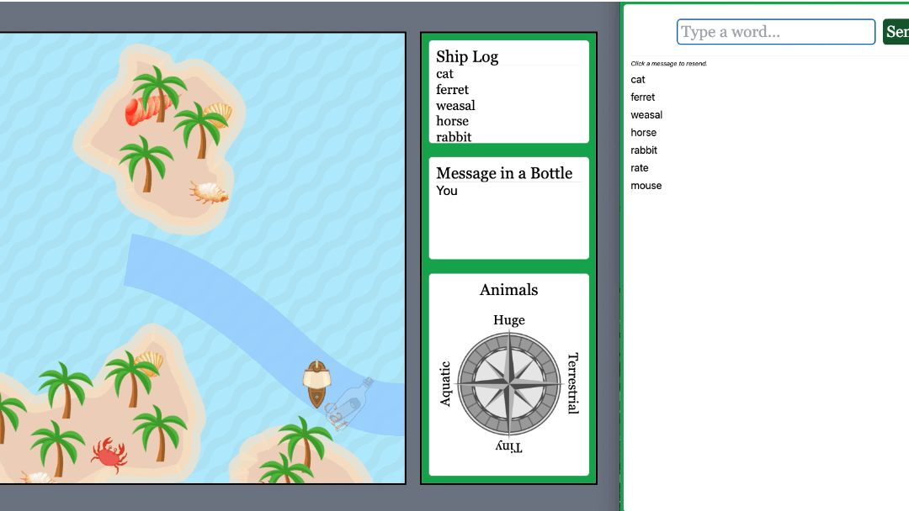

# Wordship

An educational multiplayer word game where players steer a pirate ship by typing words. Each word is semantically mapped to a 2D vector. The ship moves in the direction that reflects the word's meaning on the current topic's axes (e.g. *aquatic vs terrestrial*, *huge vs tiny*).

This game was developed for Education Game Design course project.

---
## 1. Goal of the Game

This game is useful to improve the vocabulary of the players which can be useful in daily conversations or in competitive exams.

## 2.Educational Perspective

### Behaviour Perspective

1. The player(s) cannot use the same words more than twice. If they enter the same word after entering it twice, the ship will not move. This acts as **negative reinforcement**. Also, the player cannot move if they enter words not relevant to the word compass.
2. By clicking on the Question **"?"** mark on the screen, the player(s) will receive a hint which acts like **scaffolding** in case the player is stuck.

### Cognitive Perspective

1. The player(s) must **recollect different words** to move in the direction as per the word compass. This makes them dig into words they may not have used very often. If the sense of the word is correct, the ship moves in the desired direction; otherwise, it will not move in the correct direction. This helps in **proximal development** of the player(s).

### Situated Based Perspective

1. Since this is a multiplayer game, the players will be aware of the words being used by everyone. This will help in **collaborative learning**.
2. Players can also **discuss among each other** and come up with new words so that the ship moves in the appropriate direction.

## 3. How It Works

A **host** displays the game canvas on a shared screen. **Players** join the same room and type words. Each word is looked up in a pre-computed semantic dictionary and the ship moves accordingly. The map is divided into a 3×3 grid of rooms, each with a different topic and set of semantic axes shown on a compass rose.

```
Player types "whale"
      ↓
WebSocket → signaling server → host
      ↓
"whale" → [aquatic: 0.9, huge: 0.8] → ship moves toward aquatic + huge corner
```


---

## 4. Running Locally

You need two terminals: one for the signaling server and one for the frontend.

### Start the signaling server

```bash
cd signaling_server
node server.js
# WebSocket signaling server running on ws://localhost:8080
```

### Start the frontend

```bash
cd app
npm install   # first time only
npm run dev
# http://localhost:5173
```

### Open the game

| Role | URL |
|------|-----|
| Host (game canvas) | http://localhost:5173/host?room=myroom |
| Player (word entry) | http://localhost:5173/play?room=myroom |

Open the host view on a shared/projected screen. Players join from their own devices.

---

## 5. Project Structure

```
wordship/
├── app/                        # SvelteKit frontend
│   ├── src/routes/
│   │   ├── +page.svelte        # Landing page (join / host)
│   │   ├── Comm.svelte         # WebSocket communication
│   │   ├── host/+page.svelte   # Game canvas (PixiJS)
│   │   └── play/+page.svelte   # Player word-entry view
│   └── static/                 # Game assets & word vector JSON
├── signaling_server/
│   └── server.js               # Node.js WebSocket relay
├── scores3.py                  # Data pipeline: animals
├── scores3_emotions.py         # Data pipeline: emotions
├── ocean.frag                  # GLSL ocean shader
└── *.json                      # Pre-generated word coordinate maps
```

---

## 6. Word Vector Data Pipeline

The semantic word coordinates are generated offline and served as static JSON. The pipeline:

1. **GloVe 840B embeddings** — finds words semantically close to a category (e.g. "animals")
2. **TinyLlama-1.1B** — few-shot classifies which words actually belong to the category (batched GPU inference with KV-cache reuse)
3. **GPT-3.5-turbo** — scores each word on two axes (e.g. size + aquaticity) via structured prompts
4. Normalises scores to unit-radius 2D coordinates and saves as JSON

To regenerate, you'll need a GPU, GloVe embeddings (`glove.840B.300d.txt`), and an OpenAI API key:

```bash
pip install numpy wordfreq transformers torch openai nest_asyncio tqdm
export OPENAI_API_KEY=your_key_here
python scores3.py
```

---

| Word Category | X axis | Y axis |
|---|---|---|
| Animals | Aquatic ↔ Terrestrial | Huge ↔ Tiny |
| Emotions | Intense ↔ Mild | Positive ↔ Negative |
| Politics | Evil ↔ Good | Chaos ↔ Order |

---


## Tech Stack

- **Frontend:** SvelteKit, PixiJS v8, Tailwind CSS, Vite
- **Backend:** Node.js WebSocket server (`ws`)
- **Data pipeline:** Python, PyTorch, Hugging Face Transformers, OpenAI API, GloVe
